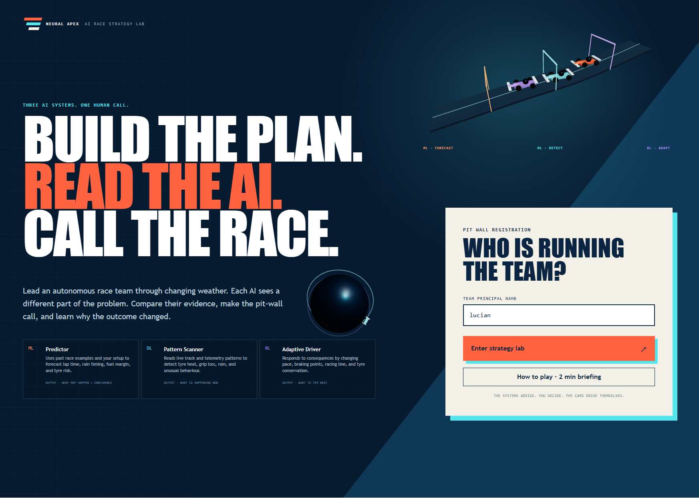
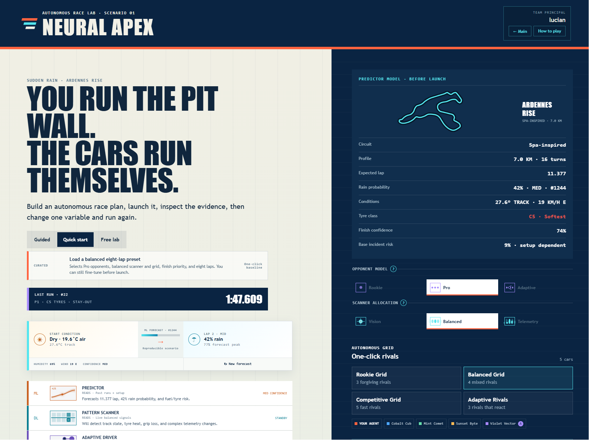
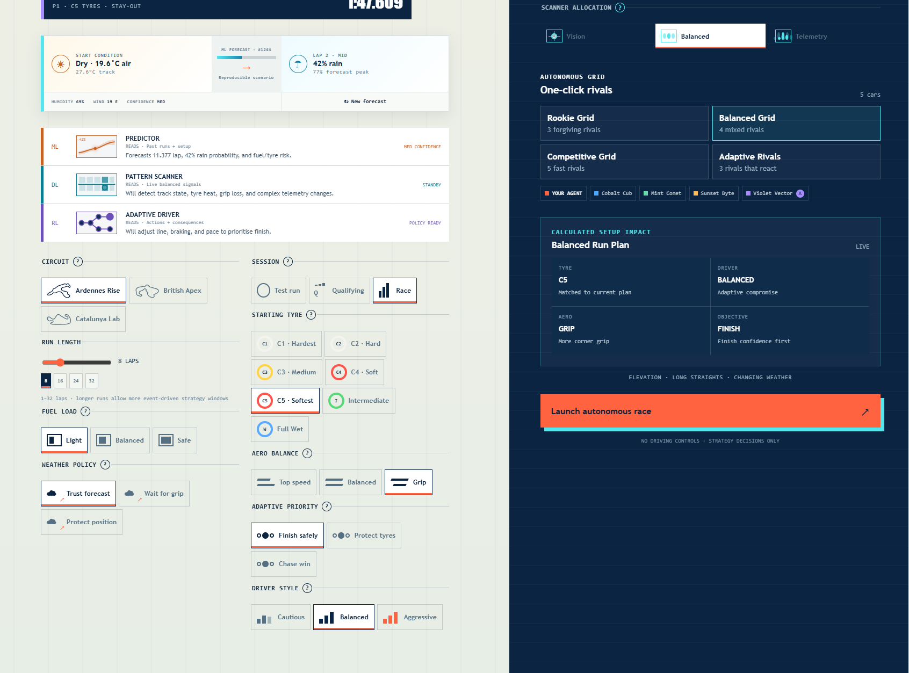
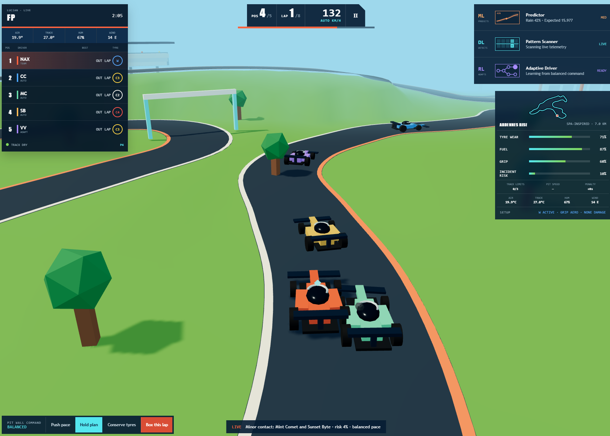

# Neural Apex

> Learn AI at racing speed—without driving the car.

Neural Apex is an autonomous 3D race-strategy lab for beginner AI education. You are the team principal, race strategist, and AI systems operator. You configure the car and AI plan, launch an autonomous run, watch telemetry and racing lines, resolve conflicting recommendations, and adjust the setup for another experiment.

There are no steering, throttle, braking, or boost controls. Player skill comes from planning, observation, judgement, and comparison.

[OpenAI Buildathon competition](https://openai.devpost.com/)

## Product preview

*Enter as team principal and meet the Predictor, Pattern Scanner, and Adaptive Driver before configuring the experiment.*

*Review the complete preflight: seeded forecast, Predictor estimate, scanner allocation, rival model, circuit profile, and calculated setup impact.*

*Configure the experiment in detail. Every selected variable changes calculated pace, wear, grip, fuel use, detection, traffic behaviour, or incident risk.*

*Watch the cars drive themselves while timing, tyre state, grip, incident risk, and all three AI systems update around the circuit.*

## The learning idea

Neural Apex turns three abstract AI ideas into three visible race-team jobs:

| System | Beginner mental model | What it does in the race |
| --- | --- | --- |
| Predictor | Machine Learning predicts | Estimates rain, lap time, fuel use, and tyre risk from past examples and structured setup data |
| Pattern Scanner | Deep Learning recognises patterns | Watches live telemetry and track state for tyre heat, grip loss, and complicated signals |
| Adaptive Driver | Reinforcement Learning adapts | Changes pace, racing line, or braking behaviour after consequences |

The systems deliberately disagree. A prediction can warn about future rain while live track recognition still reports dry asphalt and the adaptive driver prefers protecting position. The AI advises; the player decides.

## What you do

1. Choose a guided tutorial, quick start, or free race lab.
2. Select a test run, qualifying simulation, or race.
3. Configure 1–32 laps, starting tyres, fuel, aero, weather policy, scanner focus, adaptive priority, and driver style.
4. Populate the autonomous grid with one click.
5. Review the Predictor’s expected lap and risk estimates.
6. Launch the run. Every car drives itself.
7. Watch position, lap time, racing line, tyre wear, fuel, grip, detections, and adaptation.
8. Send high-level pit-wall commands: push pace, hold plan, conserve tyres, or manually Box this lap for any compound.
9. Resolve conditional strategy windows when meaningful evidence changes; the systems may agree or disagree.
10. Review a GPT-5.6 post-race debrief.
11. Change the setup and rerun to compare the new result with the previous experiment.

## MVP highlights

- Blocky low-poly 3D circuit rendered with Three.js and React Three Fiber
- Autonomous player car and autonomous rival grid
- Setup-driven pace, tyre wear, fuel use, grip, and racing-line behaviour
- Curvature-based braking/acceleration and Cautious, Balanced, or Aggressive autonomous driver styles
- Three enlarged non-crossing circuits inspired by Spa, Silverstone, and Barcelona
- C1-C5, Intermediate, and Full Wet compounds with visible weather consequences
- Test run, qualifying, and race session choices
- Rookie, balanced, competitive, and adaptive bot presets
- Live ML, DL, and RL-inspired signal rail
- High-level pace and tyre-conservation commands
- Queued “Box, box” calls, pit entry, pit limiter, track limits, time penalties, contact, damage, and retirement
- Numbered event-driven strategy windows where AI recommendations may agree or conflict
- Progressively streamed GPT-5.6 race-engineer explanation with structured evidence
- Progressively streamed five-part GPT-5.6 post-race debrief with explicit deterministic fallback
- Previous-run benchmark and setup/outcome comparison
- Guided beginner tutorial language
- FastAPI boundary for OpenAI calls
- Docker-based single-service production runtime
- Vercel hybrid deployment with a Vite SPA and streamed FastAPI Python Function
- Unit, E2E, API, build, and measured WebGL verification

## Product flow

    Configure the experiment
              |
              v
    Launch autonomous session
              |
              v
    Observe 3D race + telemetry
              |
              v
    Resolve conflicting advice
              |
              v
    Review GPT-5.6 debrief
              |
              v
    Change one variable and compare

## Architecture

The browser owns deterministic gameplay. The FastAPI service owns language generation and secrets.

    React setup / pit wall / debrief
                    |
                    v
    Deterministic TypeScript race simulation
        |           |                 |
        v           v                 v
    R3F scene   telemetry/events   run history
                    |
                    v
              FastAPI service
     /api/health /explain[/stream] /debrief[/stream]
                    |
                    v
          OpenAI Responses API
                GPT-5.6

GPT-5.6 never controls a car, chooses a strategy, calculates a result, or changes score. It receives the complete relevant current/final snapshot and explains it in plain language through validated structured output.

## Repository structure

    neural-apex/
    ├── backend/
    │   ├── main.py                  FastAPI routes and SPA serving
    │   ├── schemas.py               Request and structured-output contracts
    │   ├── prompts.py               Race-engineer and debrief instructions
    │   └── race_engineer.py         OpenAI streaming and local fallbacks
    ├── docs/
    │   ├── decisions/               Architecture and product decisions
    │   ├── PRD_v2.md                Current autonomous-game source of truth
    │   ├── architecture.md
    │   ├── project-structure.md
    │   ├── ai-learning-systems.md
    │   ├── api-contract.md
    │   ├── bot-system.md
    │   ├── gameplay-loop.md
    │   ├── setup-and-deployment.md
    │   ├── testing.md
    │   └── tutorial-flow.md
    ├── src/
    │   ├── app/                     Navigation, session state, route orchestration
    │   ├── features/
    │   │   ├── intro/               Registration and intro 3D scenes
    │   │   ├── tutorial/            Visual beginner briefing
    │   │   ├── setup/               Experiment configuration
    │   │   ├── race/                Pit wall, timing, and autonomous 3D run
    │   │   └── debrief/             Learning and run comparison
    │   ├── services/race-engineer/  Typed FastAPI/NDJSON client boundary
    │   ├── shared/ui/               Reusable circuit and AI presentation
    │   ├── simulation/              Public deterministic race-domain API
    │   └── styles/index.css         Ordered global visual system
    ├── tests/
    │   ├── unit/                     Frontend, service, simulation, topology tests
    │   ├── backend/                  FastAPI schema, endpoint, stream, fallback tests
    │   └── e2e/                      Routed Playwright strategy flows
    ├── CHANGELOG.md
    ├── CONTRIBUTING.md
    ├── DESIGN.md
    ├── ROADMAP.md
    ├── Dockerfile
    ├── docker-compose.yml
    └── package.json

## Quick start on Windows

Requirements:

- Node.js 22 or newer
- CPython 3.11 or newer
- OpenAI API key for live GPT-5.6 text; optional for fallback mode

Install:

    npm install
    python -m venv .venv
    .venv\Scripts\Activate.ps1
    python -m pip install -r requirements.txt
    Copy-Item .env.example .env

Add your key to .env:

    OPENAI_API_KEY=your_key_here
    OPENAI_MODEL=gpt-5.6

Start both Vite and FastAPI:

    npm run dev

Open http://localhost:5173.

The Vite server proxies /api requests to FastAPI at http://localhost:8787.

## Docker

Docker is the easiest production-like path:

    docker compose up --build

Open http://localhost:8787.

Verify readiness:

    Invoke-WebRequest http://localhost:8787/api/health

Expected shape:

    {
      "ok": true,
      "service": "neural-apex",
      "aiConfigured": true
    }

aiConfigured reports only whether the key exists. It never returns the key.

## Environment variables

| Variable | Required | Default | Purpose |
| --- | --- | --- | --- |
| OPENAI_API_KEY | No for fallback; yes for live GPT | none | Server-side OpenAI authentication |
| OPENAI_MODEL | No | gpt-5.6 | Model used for conflict explanations and debriefs |

The frontend never receives OPENAI_API_KEY. Do not commit .env.

## API

### GET /api/health

Returns service readiness and whether AI is configured.

### POST /api/explain

Accepts the player’s question plus compact setup, telemetry, and conflicting recommendations. Returns a concise explanation and a source value of openai or local-fallback.

### POST /api/debrief

Accepts completed-run facts: setup, events, position, lap time, tyre/fuel state, and strategy choice. Returns one beginner-friendly synthesis covering prediction, detection, adaptation, team consequence, and lesson.

See docs/api-contract.md for payload examples and trust boundaries.

For the exact effect of every mode, setup choice, weather variable, driver style, strategy window, pit phase, and incident factor, see [Gameplay calculations and experiment modes](docs/gameplay-calculations.md).

## Scripts

| Command | Purpose |
| --- | --- |
| npm run dev | Start Vite and FastAPI for local development |
| npm run dev:web | Start only Vite |
| npm run dev:api | Start only FastAPI |
| npm run lint | TypeScript project check |
| npm test | Deterministic simulation unit tests |
| npm run test:frontend | Vitest UI, service, simulation, and topology suite |
| npm run test:backend | Pytest FastAPI/schema/stream/fallback suite |
| npm run test:all | Frontend and backend suites |
| npm run test:e2e | Two autonomous runs, live GPT flow, and comparison |
| npm run build | Production frontend build |
| npm run preview | Preview the built frontend |
| npm start | Start FastAPI, which serves the built SPA |
| npm run verify | TypeScript, frontend/backend tests, and production build |

## Verification evidence

Current verified checks:

- TypeScript: pass
- Frontend unit, UI, service, simulation, and topology tests: 57/57 pass
- Backend endpoint, schema, streaming, parsing, fallback, and Vercel contract tests: 10/10 pass
- Production build: pass
- Playwright autonomous flows: 3/3 pass
- Live OpenAI request through FastAPI: pass, source openai
- Full E2E: pass, including two runs and comparison
- Desktop WebGL canvas: nonblank, zero console/page errors
- Mobile WebGL canvas: nonblank, zero console/page errors
- Desktop render snapshot: 161 calls, 4,074 triangles, 97 geometries, 3 textures
- Mobile render snapshot: 133 calls, 3,650 triangles, 97 geometries, 3 textures
- Production dependency audit: zero vulnerabilities

The bundled Three.js QA thresholds are 300 desktop calls and 150 mobile calls, so both measured snapshots are within the starting budgets.

## GPT-5.6 usage

GPT-5.6 is concentrated in the two moments where language creates the most educational value:

1. Post-race debrief: connects the Predictor’s expectation, Scanner’s detection, Driver’s adaptation, team decision, and one plain-language lesson.
2. Conflict explanation: explains why future prediction, present recognition, and consequence-based strategy can disagree.

FastAPI returns deterministic local explanations if the key is missing, the API is unavailable, or the request fails. The race always remains playable.

## How Codex was used

Codex helped turn the PRD into the autonomous strategy architecture, discover and apply relevant Three.js/React/testing skills, implement and refactor the full stack, diagnose integration defects, and run unit, E2E, Docker, API, and measured WebGL QA. GPT-5.6 is the in-product race engineer and learning coach; it is deliberately separated from deterministic gameplay.

For the detailed development record, boundaries, prompts, fallbacks, verification, and submission evidence, see [How Codex and GPT-5.6 are used](docs/codex-and-gpt-usage.md).

## Honest limitations

- The ML, DL, and RL systems are educational simulations using deterministic formulas, rules, and state changes; no model is trained in the browser.
- One Sudden Rain scenario is fully implemented.
- Vehicle movement is kinematic and waypoint-based, not realistic motorsport physics.
- Run history and the latest result are session-scoped; closing the browser session clears them.
- Bot adaptation is lightweight and scenario-scoped.
- The Three.js race chunk is still large, but it is lazy-loaded so the setup screen ships in a much smaller initial bundle. Further vendor splitting is a post-MVP optimisation.
- Real-time multiplayer, careers, detailed damage, and user-created tracks are out of scope.

## Documentation

- Product and visual design system: [DESIGN.md](DESIGN.md)
- Contribution workflow: [CONTRIBUTING.md](CONTRIBUTING.md)
- Submission roadmap: [ROADMAP.md](ROADMAP.md)
- Current PRD: docs/PRD_v2.md
- Architecture: docs/architecture.md
- Project structure and dependency rules: docs/project-structure.md
- Gameplay loop: docs/gameplay-loop.md
- AI learning systems: docs/ai-learning-systems.md
- API contract: docs/api-contract.md
- Bots: docs/bot-system.md
- Tutorial: docs/tutorial-flow.md
- Setup and deployment: docs/setup-and-deployment.md
- Testing: docs/testing.md
- Development checklist: docs/development-checklist.md
- Gameplay calculations and experiment modes: docs/gameplay-calculations.md
- Codex and GPT-5.6 usage: docs/codex-and-gpt-usage.md
- Autonomous-strategy decision: docs/decisions/002-autonomous-strategy-loop.md
- Seeded simulation and streamed-AI decision: docs/decisions/003-seeded-simulation-and-streamed-ai.md

## Built with

React, TypeScript, Vite, Three.js, React Three Fiber, FastAPI, the OpenAI Responses API, Vitest, Playwright, and Docker.

The submission should include the primary Codex /feedback Session ID required by the competition form.

See [CHANGELOG.md](CHANGELOG.md) for the implementation history.
